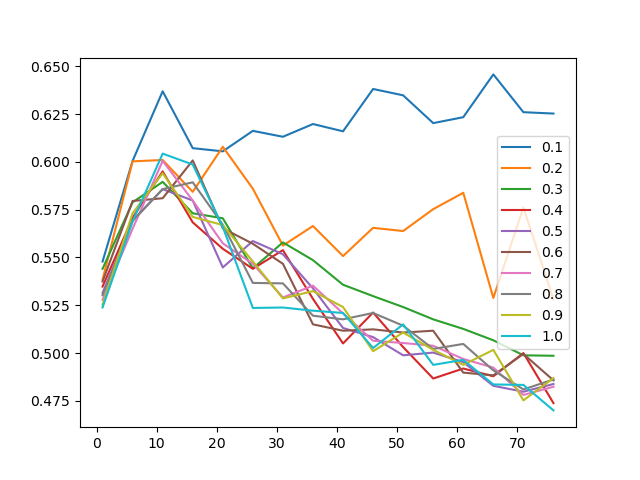

# boosTran
A little idea about adaboost

## Introduction
Another tiny little project. The idea is that in adaboost, the optimization of the whole set of weights and weak learner function is infeasible, so an iterative method is needed. But the Iterative method is somehow not that intuitive and efficient. So I wanna find a way to minimize the Loss function in a global sense.  
The basic idea for adaboost is we regard the weak learner as somehow a bunch of basis, and find a suiable weights for all of them. So, the assumption would be, there are a sets of weak learner function at the beginning, and the problem will reduced to the region of linear algebra.

## Dataset
I used the [Coffee : EDA](https://www.kaggle.com/code/tumpanjawat/coffee-eda-geo-cluster-regression#2-%7C-Exploratory-Data-Analysis-) from kaggle as in the lecture does.

## Impementation
If we want this algorithm to preform well, we need to make sure that the basis is as uncorrelated as possible. Hence we can apply following method to ensure this property: 
1. Boosting sampling of data (or even features)
2. Postprocessing like Grand-schmidt or PCA (QR decomposition)
3. Check the rank of the outcome.

With the implementation of Boostrap sample, I've got the following result:
  
We can see that with `bootstrap_ratio=0.1` got the best result, because the samples a the most uncorrelated, so that the final transformation matrix is 'healthy'. And the idea nunmber of weak learner is around 5 to 15. But the outcome is still not good enough. 

Since in the real application, the dataset supposed to be way larger than the number of weak learners. The matrix that we are going to get at the end should have infinitely many solution. So, a psuedoinverse will be calculated.