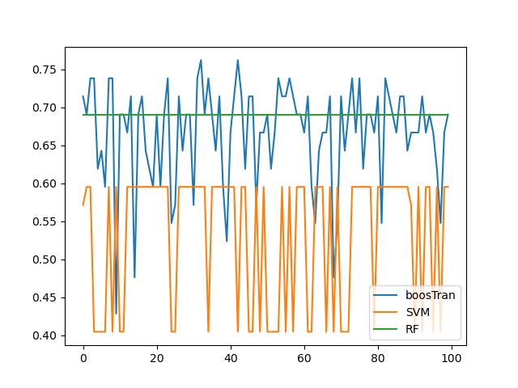

# boosTran
A little idea about adaboost

## Introduction
Another tiny little project. The idea is that in adaboost, the optimization of the whole set of weights and weak learner function is infeasible, so an iterative method is needed. But the Iterative method is somehow not that intuitive and efficient. So I wanna find a way to minimize the Loss function in a global sense. <br>
The basic idea for adaboost is we regard the weak learner as somehow a bunch of basis, and find a suiable weights for all of them. So, the assumption would be, there are a sets of weak learner function at the beginning, and the problem will reduced to the region of linear algebra.
Since in the real application, the dataset supposed to be way larger than the number of weak learners. The matrix that we are going to get at the end should have infinitely many solution. So, one of the major problem in this project is to determine the right weight metrics to be used. 

## Dataset
I used the [Coffee : EDA](https://www.kaggle.com/code/tumpanjawat/coffee-eda-geo-cluster-regression#2-%7C-Exploratory-Data-Analysis-) from kaggle as in the lecture did. For more information see preprocessing python script `dataUtils.py`.

## Impementation
If we want this algorithm to preform well, we need to make sure that the basis is as uncorrelated as possible. Hence we can apply following method to ensure this property:<br>
1. Boosting sampling of data (or even features)
2. Postprocessing like Grand-schmidt or PCA (QR decomposition)
3. Check the rank of the outcome.
4. Increase the expressiveness of the single model.


### Bootstrap Sampling
With the implementation of Boostrap sample, I've got the following result:<br>
 <br>
We can see that with `bootstrap_ratio=0.1` got the best result, because the samples a the most uncorrelated, so that the final transformation matrix is 'healthy'. And the idea nunmber of weak learner is around 5 to 15. But the outcome is still not good enough. <br>

### Increase Depth of the Weak lerners
Then I tried to increse the expressiveness of the weaklearner, hope that will give the result more degrees of freedom. After I increase the `max_depth` of the decision tree to 2, the model preforms better.<br>
 <br>
Another interesting fact is that, while the complexity of the model is increasing, the one with higher `boostrap_ratio` tends to overpreform the one with lower. As we can see in the `max_depth3`.<br>
 <br>

### Interesting
Something else might be fun: In all the model, the model will aquire the highest perfoemance, is around 15 weaklearner(as we increase the expresiveniss). My assumption: it is related to the number of feature that we are using, as the model depends on the number of features that we use, we can't expect a higher DoF than the number of feature, everything greater than 15, in this case, will be overfitting.<br>

So, in the following testing, I set the `num_learner` always to the number of features. And than I compared the influence of the depth of the tree, which the result shows as follow:<br>
 <br>
The model is underfitting if there arn't enough depth in the weak learner. It can be treateed as a hyperparameter.


### Retrieving the weights
After we've chosen the set of weak learners, the next problem is how to calculate the weights for each one of them, here I propose three simple method:

#### Projection
The simplest is just to do the projection, we project the final outcome to each of the data column to obtain our final value. And also, we should do the normalization.
#### Pseudo Inverse
The first method that I came up with to solve this question is to use the Pseudo Inverse, since the matrix will be normally underdetermined. It can be realized with simple line of code in python:
```python
np.linalg.pinv(P) @ y
```
#### SVD
I alse tried to formulate the problem as a optimization problem that we calculate the weights subject to the condition that all the weights add up to one.
$$loss = (P * w - y)^2 + \lambda (w^T * w) $$
And after a few steps of calculation, the program reduced to an EWVD problem. Since EVD is not available in this case, I've tried SVD (a stupid mistake), and it finally didn't work out.

#### Another optimization problem
Finally it occurrs to me that all weights should be positive in adaboost to ensure the correctness in the weight updating formular. So, I reformulated the optimization problem:
$$\underset{b, \lambda}{argmin} [\sum_{n=1}^N (y_n - f(x_n)^Tb)^2 - \sum_{i=1}^K\lambda_ib_i]$$
After a few step I gave up for I have no clue how to solve it after I wrote down the KKT conditions. So, I used the python optimization package to directly calcalate the nummeric solution.

The result of those attampts shows as follows:<br>
 <br>

The SVD preforms bad, because my calculations are wrong, other methods haa almost the same accuracy. `opt` is significantly slower as it solves a numeric optimizations problem.

## Benchmark and Conclution

 <br>
No time to dig deeper in this thema. The benchmark might be wrong. But it is really an interesting direction. I'll come back later when there is stll time for that.
